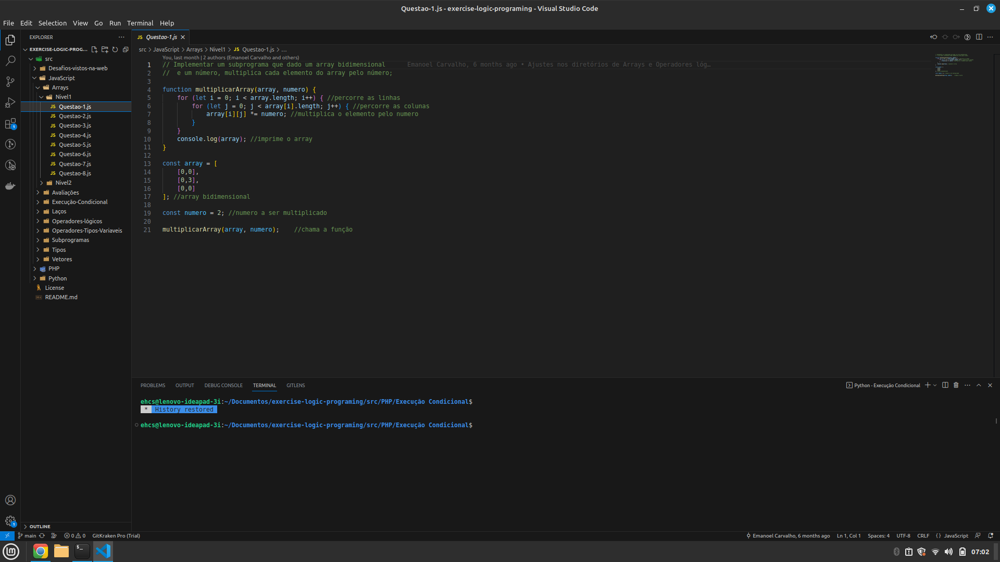

# Resolução das Questões de Lógica de Programação - Semestre 2022.2

Este repositório contém a resolução das questões de lógica de programação referentes ao semestre 2022.2, onde fui monitor. As soluções foram implementadas utilizando as linguagens JavaScript e Python.

# Observação para os Alunos

Caros estudantes,

Este repositório contém as soluções para as questões de lógica de programação referentes ao semestre 2022.2, onde fui monitor. Gostaríamos de enfatizar que as soluções fornecidas aqui são destinadas a ser uma ferramenta de consulta e aprendizado, e não devem substituir o seu esforço individual na compreensão e resolução das questões.

É fundamental que vocês tentem resolver as questões por conta própria antes de consultar as soluções. O processo de tentativa e erro, a pesquisa e a resolução de problemas são partes essenciais do desenvolvimento de suas habilidades em lógica de programação. Utilizem este repositório como uma referência para verificar e comparar suas soluções após terem feito um esforço genuíno para resolvê-las.

Lembramos que a aprendizagem é um processo ativo e a prática constante é fundamental para o seu sucesso. Utilizem estas soluções como um recurso para esclarecer dúvidas, aprender novas abordagens e melhorar suas habilidades de programação.

Se tiverem alguma dúvida ou precisarem de assistência adicional, não hesitem em entrar em contato. Estamos aqui para ajudar e apoiar o seu aprendizado.

Desejamos a todos um semestre produtivo e cheio de aprendizado!

Atenciosamente,

Emanoel Carvalho.

# Descrição do Repositório

Neste repositório, você encontrará um conjunto de arquivos que contêm as soluções para as questões de lógica de programação propostas durante o semestre. As questões estão organizadas em pastas, sendo que cada pasta representa um tópico ou uma lista de exercícios específica.

O objetivo deste repositório é fornecer um material de referência para estudantes da disciplina lógica de programação e estrutura de dados, permitindo que eles consultem as soluções implementadas em JavaScript e Python para as questões propostas. As soluções são fornecidas como uma forma de auxílio e aprendizado, podendo ser utilizadas como base para o desenvolvimento de soluções próprias.

# Organização do Repositório

O repositório está organizado da seguinte forma:

Dentro de cada pasta de tópico, você encontrará os arquivos individuais para cada questão resolvida. Cada arquivo contém a implementação da solução em JavaScript e Python e pode ser executado separadamente.

# Como Utilizar as Soluções

Para utilizar as soluções, você precisará de um ambiente de execução JavaScript, como o Node.js, e um ambiente de execução Python instalados em sua máquina. Certifique-se de ter o Node.js e o Python instalados em sua máquina.

Clone este repositório em sua máquina local usando o seguinte comando:

# git clone https://github.com/emanoelCarvalho/exercise-logic-programing.git

Navegue até a pasta do repositório:

# cd exercise-logic-programing

Acesse a pasta do tópico desejado:

# cd ./Laços/Nivel1/

Execute o arquivo da questão específica utilizando o Node.js para as soluções em JavaScript:

# node nome-do-arquivo.js

Execute o arquivo da questão específica utilizando o Python para as soluções em Python:

# python nome-do-arquivo.py

Certifique-se de substituir "nome-do-arquivo.js" pelo nome correto do arquivo que contém a solução em JavaScript e "nome-do-arquivo.py" pelo nome correto do arquivo que contém a solução em Python.

# Contribuição

Se você identificar algum problema nas soluções fornecidas ou desejar adicionar suas próprias soluções, sinta-se à vontade para abrir uma issue ou enviar um pull request. Suas contribuições são muito bem-vindas!

# Licença

Este repositório está licenciado sob a licença MIT. Consulte o arquivo LICENSE para obter mais informações.

# Contato

Se você tiver alguma dúvida ou precisar entrar em contato, sinta-se à vontade para enviar um e-mail para hemanoel718@gmail.com.

Espero que essas soluções sejam úteis para você.

## LinkedIn

Você pode me encontrar no LinkedIn em [Emanoel Carvalho](https://www.linkedin.com/in/emanoelcarvalho/).

Espero que essas resoluções sejam úteis para você.
